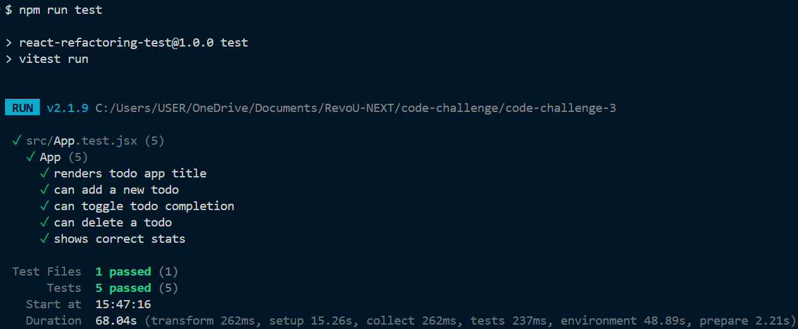

# Refactoring Documentation — React Todo App

## Overview

Audit and surgical fixes applied to a React Todo List application. The goal was to improve code quality across four areas — **security**, **performance**, **code quality**, and **accessibility** — without breaking existing functionality or adding new features.

All 5 existing tests pass after every fix.

---

## Commit History

Each fix is one atomic commit, ordered by priority (most critical first).

---

### commit 1 — `fix: remove hardcoded API key`

**File:** `src/App.jsx`

**Issue:**
A secret API key was declared as a module-level constant at the top of the component file:

```js
// Before
const API_KEY = 'sk-1234567890abcdef'
```

**Why it matters:**
Hardcoded secrets in source code are exposed to anyone with access to the repository. In a frontend bundle, they are also visible to any user who inspects the JavaScript served by the browser — regardless of whether the repo is public or private.

**Fix:**
Removed the constant entirely. API keys must never live in frontend source code. If an API key is genuinely needed, it should be loaded from an environment variable (e.g. `import.meta.env.VITE_API_KEY`) and the `.env` file must be listed in `.gitignore`.

---

### commit 2 — `fix: replace dangerouslySetInnerHTML with safe text rendering`

**File:** `src/App.jsx`

**Issue:**
Todo text entered by the user was rendered as raw HTML:

```jsx
// Before
<span dangerouslySetInnerHTML={{ __html: todo.text }} />
```

**Why it matters:**
This is a Cross-Site Scripting (XSS) vulnerability. A user could enter a string like `` and the browser would execute it. In a shared or multi-user context, this becomes a serious attack vector.

**Fix:**
```jsx
// After
<span>{todo.text}</span>
```

React automatically escapes text content when rendered this way. No library or additional sanitization needed.

---

### commit 3 — `fix: remove leftover console.log debug statements`

**File:** `src/App.jsx`

**Issue:**
Two `console.log` calls were left in the JSX return block, one of which printed the API key:

```jsx
// Before
{console.log('Rendering with todos:', todos)}
{console.log('API Key:', API_KEY)}
```

**Why it matters:**
Debug logs in production expose internal application state to the browser console. The second log compounded the security issue from commit 1 by broadcasting the API key on every render.

**Fix:**
Removed both statements entirely.

---

### commit 4 — `fix: add dependency array to localStorage useEffect`

**File:** `src/App.jsx`

**Issue:**
The effect that saves todos to `localStorage` had no dependency array:

```js
// Before
useEffect(() => {
  localStorage.setItem('todos', JSON.stringify(todos))
})
```

**Why it matters:**
Without a dependency array, this effect runs after every render — including renders caused by typing in the input field. This means a `localStorage.setItem` call fires on every keystroke, which is unnecessary I/O.

**Fix:**
```js
// After
useEffect(() => {
  localStorage.setItem('todos', JSON.stringify(todos))
}, [todos])
```

The effect now only runs when `todos` actually changes.

---

### commit 5 — `fix: add error handling for localStorage parsing`

**File:** `src/App.jsx`

**Issue:**
The effect that loads todos from `localStorage` did not handle malformed data:

```js
// Before
useEffect(() => {
  const saved = localStorage.getItem('todos')
  if (saved) {
    setTodos(JSON.parse(saved))
  }
}, [])
```

**Why it matters:**
If the stored value is corrupted (e.g. truncated due to storage quota, or manually edited), `JSON.parse` throws and crashes the component tree with an unhandled exception.

**Fix:**
```js
// After
useEffect(() => {
  const saved = localStorage.getItem('todos')
  if (saved) {
    try {
      setTodos(JSON.parse(saved))
    } catch {
      localStorage.removeItem('todos')
    }
  }
}, [])
```

On parse failure, the bad entry is cleared so the app starts fresh instead of crashing.

---

### commit 6 — `fix: use crypto.randomUUID() instead of Date.now() for IDs`

**File:** `src/App.jsx`

**Issue:**
New todos were assigned IDs using `Date.now()`:

```js
// Before
const newTodo = {
  id: Date.now(),
  ...
}
```

**Why it matters:**
`Date.now()` returns a millisecond timestamp. Two todos created within the same millisecond (possible under fast input or programmatic use) would share the same ID, causing React key collisions and potential state bugs.

**Fix:**
```js
// After
const newTodo = {
  id: crypto.randomUUID(),
  ...
}
```

`crypto.randomUUID()` generates a cryptographically random UUID (RFC 4122 v4). It is available natively in all modern browsers with no additional dependencies.

---

### commit 7 — `fix: memoize handlers with useCallback`

**File:** `src/App.jsx`

**Issue:**
Handler functions `addTodo`, `deleteTodo`, `toggleTodo`, and the filter setters were redeclared on every render:

```js
// Before — new function instance created on every render
const addTodo = () => { ... }
const deleteTodo = (id) => { ... }
const toggleTodo = (id) => { ... }
```

**Why it matters:**
Functions created inline are new references on each render. If passed as props to child components, they would trigger unnecessary re-renders in those children. Inline arrow functions in JSX event handlers (e.g. `onClick={() => setFilter('all')}`) also follow this pattern.

**Fix:**
Wrapped all handlers with `useCallback`, and extracted filter handlers to stable named callbacks:

```js
const addTodo = useCallback(() => { ... }, [input])
const deleteTodo = useCallback((id) => { ... }, [])
const toggleTodo = useCallback((id) => { ... }, [])
const handleFilterAll = useCallback(() => setFilter('all'), [])
```

Additionally, the inline `onKeyPress` (deprecated) was replaced with `onKeyDown` using a memoized handler.

---

### commit 8 — `fix: memoize filteredTodos and stats with useMemo`

**File:** `src/App.jsx`

**Issue:**
The filtering logic and stats calculation ran on every render regardless of what changed:

```js
// Before — recalculated on every render, including unrelated state changes
const getFilteredTodos = () => { ... }

const stats = {
  total: todos.length,
  completed: todos.filter(t => t.completed).length,
  active: todos.filter(t => !t.completed).length,
}
```

**Why it matters:**
These calculations iterate over the full `todos` array. With many todos, this becomes non-trivial work done even when the user is just typing in the input field.

**Fix:**
```js
const filteredTodos = useMemo(() => {
  if (filter === 'active') return todos.filter(t => !t.completed)
  if (filter === 'completed') return todos.filter(t => t.completed)
  return todos
}, [todos, filter])

const stats = useMemo(() => ({
  total: todos.length,
  completed: todos.filter(t => t.completed).length,
  active: todos.filter(t => !t.completed).length,
}), [todos])
```

Both now only recalculate when their actual dependencies (`todos` or `filter`) change.

---

### commit 9 — `fix: replace inline styles with CSS classes`

**Files:** `src/App.jsx`, `src/index.css`

**Issue:**
The filter button section used inline styles inconsistent with the rest of the codebase:

```jsx
// Before
<div style={{ marginBottom: '20px', display: 'flex', gap: '10px' }}>
  <button style={{ background: filter === 'all' ? '#28a745' : '#007bff' }}>
    All
  </button>
  ...
</div>
```

**Why it matters:**
Inline styles bypass the stylesheet, making the code harder to maintain and inconsistent with the existing CSS-based styling approach. They also recreate style objects on every render.

**Fix:**
Moved all styles to dedicated classes in `index.css`:

```css
.filter-section { display: flex; gap: 10px; margin-bottom: 20px; }
.filter-btn { background: #007bff; }
.filter-btn.active { background: #28a745; }
```

And updated JSX to use class names:

```jsx
<div className="filter-section">
  <button
    className={filter === 'all' ? 'filter-btn active' : 'filter-btn'}
  >
    All
  </button>
</div>
```

---

### commit 10 — `fix: add accessibility labels, empty state, and ARIA attributes`

**Files:** `src/App.jsx`, `src/index.css`

**Issues found:**

| Element | Problem |
|---------|---------|
| Text input | No `<label>` — screen readers cannot identify the field |
| Checkbox | `aria-label` missing — screen reader only says "checkbox" |
| Delete button | No context — screen reader says "Delete" without saying what |
| Filter buttons | Active state not communicated to assistive technology |
| Empty list | No message shown when there are no todos |
| Stats section | Changes not announced to screen readers |

**Fix:**

Added a visually hidden label for the input:
```jsx
<label htmlFor="todo-input" className="visually-hidden">New todo</label>
<input id="todo-input" aria-label="New todo" ... />
```

Added descriptive `aria-label` to interactive elements:
```jsx
<input aria-label={`Mark "${todo.text}" as ${todo.completed ? 'active' : 'completed'}`} />
<button aria-label={`Delete "${todo.text}"`}>Delete</button>
```

Added `aria-pressed` to filter buttons to communicate selected state:
```jsx
<button aria-pressed={filter === 'all'} ...>All</button>
```

Added empty state message:
```jsx
{filteredTodos.length === 0 && (
  <p className="empty-state">
    {filter === 'all' ? 'No todos yet. Add one above!' : `No ${filter} todos.`}
  </p>
)}
```

Added `aria-live="polite"` to the stats section so screen readers announce changes automatically.

Added `.visually-hidden` utility class to `index.css` — hides elements visually while keeping them accessible.

---

## Intentionally Not Changed

### issue 2 — state management (no fix needed)

The original code flagged this with a comment:

```js
// Issue 2: State management bisa lebih baik
const [todos, setTodos] = useState([])
const [input, setInput] = useState('')
const [filter, setFilter] = useState('all')
```

After review, **no change was made here.** Three separate `useState` calls is the correct approach for this case, for two reasons:

**Each state has a different update frequency.** `input` changes on every keystroke, `filter` only when the user clicks a button, and `todos` only on add/delete/toggle. Combining them into a single state object would mean every character typed in the input field triggers a re-render that includes `todos` and `filter` — unnecessary work.

**There is no derived state being stored.** A common state management smell is storing computed values (like `filteredTodos` or `stats`) in `useState` instead of deriving them at render time. That was indeed an issue here, but it was addressed in commit 8 by moving those calculations to `useMemo` — not by restructuring the state shape.

Merging these three into one object (e.g. `const [state, setState] = useState({ todos, input, filter })`) would add complexity without any benefit. The existing structure is already optimal.

---

## Files Changed

| File | Changes |
|------|---------|
| `src/App.jsx` | All 10 fixes applied |
| `src/index.css` | Added `.filter-section`, `.filter-btn`, `.filter-btn.active`, `.empty-state`, `.visually-hidden` |

## Files Unchanged

`index.html`, `src/main.jsx`, `src/App.test.jsx`, `src/test/setup.js`, `package.json`, `vite.config.js`

---

## Test Results

```
✓ src/App.test.jsx (5 tests)

  ✓ renders todo app title
  ✓ can add a new todo
  ✓ can toggle todo completion
  ✓ can delete a todo
  ✓ shows correct stats

Test Files  1 passed (1)
Tests       5 passed (5)
```
